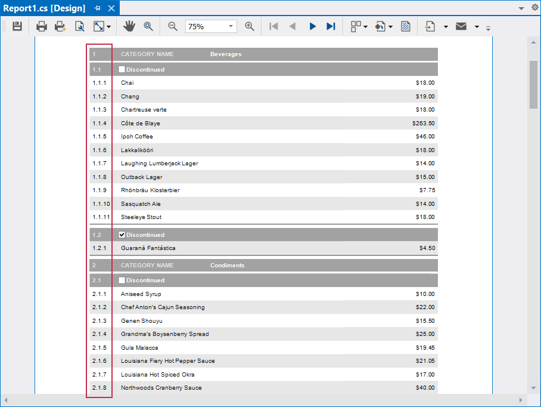

<!-- default badges list -->

<!-- default badges end -->
# Visual Studio Report Designer - Group Numbering by Index

The following example generates a report with a multi-level numbered list. To achieve this report layout, report controls use `GroupIndex()` and `CurrentRowIndexInGroup()` functions within data binding expressions (to return group and row indexes).

The following image illustrates output for a report designed to group information by product category and discontinued state:

## Files to Review

- [Report1.cs](./CS/ReportingExpressionFunctions/Report1.cs) 
- [Report1.Designer.cs](./CS/ReportingExpressionFunctions/Report1.Designer.cs)   
- [Report1.resx](./CS/ReportingExpressionFunctions/Report1.resx)

## Documentation

- [Group Numbering by Index](https://docs.devexpress.com/XtraReports/404915/detailed-guide-to-devexpress-reporting/use-expressions/expressions-tasks-and-solutions/group-numbering-by-index?v=24.1)

<!-- feedback -->
## Does this example address your development requirements/objectives?

 

(you will be redirected to DevExpress.com to submit your response)
<!-- feedback end -->
